# Architecture

Visual Compiler Next separates compile-time intelligence from clinical execution by both policy and code path.

```mermaid
flowchart LR
  S[Synthetic fixture or authorized training tenant] --> A[Local synthetic attestation]
  A --> R[Mandatory page-model redaction]
  R --> C[GPT-5.6 compile-time boundary]
  C --> I[Validated Semantic IR]
  I --> W[Versioned deterministic workflow]
  W --> V[Validation]
  V --> H[Human approval]
  H --> P[Promoted artifact + SHA-256]
  P --> F[Local structural preflight]
  F --> X[Clinical deterministic runtime]
  X --> Z[Zero LLM calls]
```

`packages/clinical-safety` owns profiles, URL policy, attestation, redaction, structural fingerprints, workflow lifecycle, preflight, audit redaction, and ephemeral parameters. `packages/compiler` remains the only OpenAI-capable package. `packages/runtime` has no OpenAI dependency and blocks browser requests to OpenAI. `apps/demo-site` hosts only controlled fixtures. `apps/studio` exposes distinct training and clinical surfaces.

Training and clinical may share an origin, so mode is never inferred from origin. Separate browser profile IDs, independent manually authenticated sessions, explicit attestation, artifact state, and backend authorization distinguish them.

Artifacts remain exclusive and versioned. Existing files cannot be silently overwritten. SHA-256 is verified before a promoted workflow may run. Ed25519 with a private key outside the repository is the next integrity milestone.
