# Architecture

Visual Compiler Next separates compile-time intelligence from clinical execution by both policy and code path.

```mermaid
flowchart LR
  S[Synthetic fixture or authorized training tenant] --> A[Local synthetic attestation]
  A --> R[Mandatory page-model redaction]
  R --> C[GPT-5.6 compile-time boundary]
  C --> I[Validated Semantic IR]
  I --> W[Versioned deterministic workflow]
  W --> V[Validation]
  V --> H[Human approval]
  H --> P[Promoted artifact + SHA-256]
  P --> F[Local structural preflight]
  F --> X[Clinical deterministic runtime]
  X --> Z[Zero LLM calls]
```



`packages/clinical-safety` owns profiles, URL policy, attestation, redaction, structural fingerprints, workflow lifecycle, preflight, audit redaction, and ephemeral parameters. `packages/compiler` remains the only OpenAI-capable package. `packages/runtime` has no OpenAI dependency and blocks browser requests to OpenAI. `apps/demo-site` hosts only controlled fixtures. `apps/studio` exposes distinct training and clinical surfaces.

`packages/page-model` extracts a value-free semantic graph in memory. It records interactive roles/control types, accessibility names and label sources, bounded control/interface text, nearby headings, geometry, state, parent/child/sibling references, and DOM/visual order. Hidden controls and arbitrary body content are excluded. `createRedactedCompilerPageModel` canonicalizes the URL to `origin + pathname`, filters to interactive/structural nodes, classifies retained text, and emits count-only redaction diagnostics. Studio binds human confirmation to the SHA-256 of that exact preview.

`packages/locator-engine` ranks deterministic candidates in this order: role/name, associated label, placeholder/control type, control text, DOM-anchor relation, spatial relation, role ordinal, and control-type ordinal. Compilation records the candidate count and selected strategy for every step; zero-candidate errors expose only redacted counts, never captured labels or values.

Training and clinical may share an origin, so mode is never inferred from origin. Separate browser profile IDs, independent manually authenticated sessions, explicit attestation, artifact state, and backend authorization distinguish them.

Managed Training navigation is a two-state machine:

```text
Open in managed browser
→ AUTHENTICATION BOOTSTRAP
  HTTPS SSO redirects/popups allowed; capture/compile denied
→ primary page returns to configured application origin
→ explicit human lock
→ APPLICATION LOCKED
  main-page origin enforced; capture/compile may proceed
```

The managed browser context is ephemeral and memory-only. Route policy distinguishes primary-page navigation from iframe navigation, popup navigation, and subresources. OpenAI HTTP/WebSocket traffic is blocked in both states. Cross-origin frames may render after lock but never enter the page model.

Artifacts remain exclusive and versioned. Existing files cannot be silently overwritten. SHA-256 is verified before a promoted workflow may run. Ed25519 with a private key outside the repository is the next integrity milestone.
